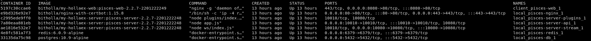
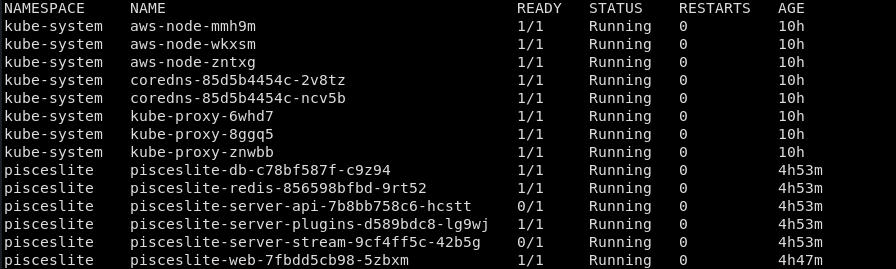
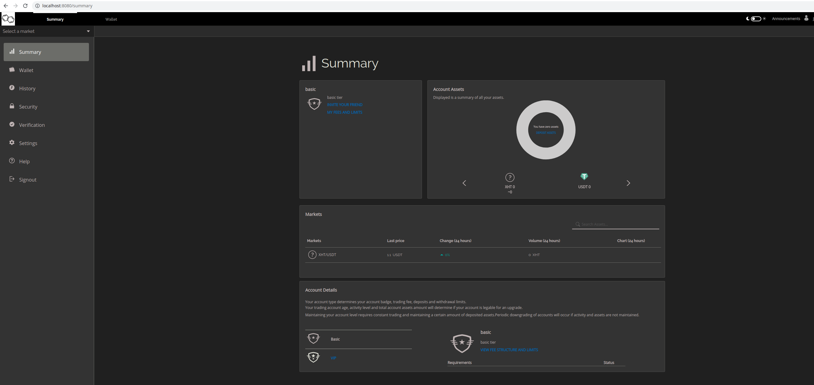

### [HelloEx Docs](https://docs.hollaex.com/)
1. Followed [install](https://docs.hollaex.com/get-started/installation) and [setup](https://docs.hollaex.com/get-started/setup) steps for local run. Install results in two db, 3 server, 1 web, and 1 nginx related containers. HolloEx cli only requires a few commands to get to this point. Under the hood is leveraging docker-compose for local setup.

2. Used aws eks to set our clusters kubeconfig locally. 
```
aws eks update-kubeconfig  --region us-west-2 --name pisces-eksCluster-86e6080
```
3.  Ran setup command for kubernetes. HollaEx wants an install specific image pushed to repo. The CLI takes docker credentials and creates a secret, but initial install results in auth issues in pulling the images in cluster.
```
hollaex server --setup --kube
hollaex server --start --kube
hollaex web --setup --kube
hollaex web --start --kube

```
4. Setup ECR repos for images, re-ran setup targeting new repos.

5. Explored more of HollaEx interface and admin options
6. HollaEx uses it's own eth based token for funding features and as the intermediary ledger for transactions
7. A good chunk of features seems to be closed source including using a private HollaEx testnet
### Conclusion
HollaEx provided a good overview to several crypto exchange components. Their CLI abstracts a number of helm, docker build/tag/push, and kubectl exec commands into a very simple deployment. Now that I have an overview of moving parts, I think deploying some base level components (wallet, testnet) will be more beneficial than deep diving a large and partly closed source project.


